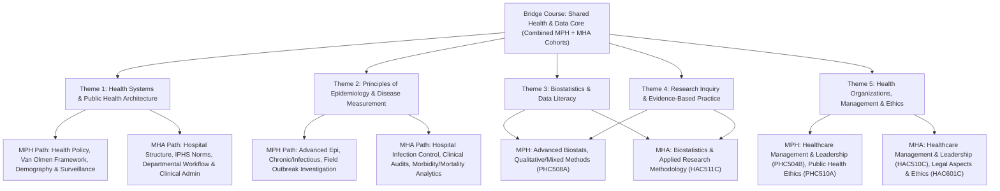

# Bridge Course Framework: Common Foundations for MPH & MHA
**Ramaiah School of Public Health (RSPH) / Faculty of Life & Allied Health Sciences, MSRUAS**
*Programmes Covered:* Master of Public Health (097) & Master in Hospital Administration (098)  
*Foundational Textbooks Referenced:* Gordis Epidemiology (7th ed.), Basic Epidemiology (WHO), Park PSM (28th ed.), Oxford Textbook of Public Health, IPHS 2022 Guidelines, Rothman Biostatistics & Medical Statistics.

---

## 1. Executive Rationale & Alignment

Incoming students for both **Master of Public Health (MPH)** and **Master in Hospital Administration (MHA)** come from diverse academic backgrounds—including clinical graduates (MBBS, BDS, AYUSH, BSc Nursing, Allied Health) as well as non-clinical/management graduates (Life Sciences, Commerce, Engineering, Social Sciences). 

Based on the approved **Programme Specifications (PS)** and **Course Specifications (CS)**:
- **MPH** is anchored on population-level inquiry, determinants of health, epidemiological investigation, disease surveillance, and health policy.
- **MHA** is anchored on healthcare institutions, operational workflows, clinical and support services management, financial/HR management, and hospital quality.
- **The Common Ground:** Over **8 core teaching themes** overlap significantly (ranging from 70% to ~90% content concordance). 

A dedicated **Bridge Course** preceding Semester 1 equips all incoming students with baseline quantitative, analytical, health systems, and organizational competencies necessary for both cohorts.

---

## 2. Programme Outcomes (POs) & Specific Outcomes (PSOs) Mapping

### 2.1 MPH Outcomes (Programme Code 097)
- **PEO-1 to PEO-4**: Strong foundation in public health principles, research problem-solving, innovative technological and behavioral interventions, managerial/entrepreneurial leadership, and global ethics.
- **POs (PO-1 to PO-12)**: Public health knowledge, problem analysis, solution design, investigation of complex problems, modern tool usage, societal and environmental context, ethics, multidisciplinary teamwork, communication, project management, and life-long learning.
- **PSOs**: 
  - **PSO-1:** Apply epidemiology, biostatistics, and behavioral science to health challenges.
  - **PSO-2:** Adapt to technological advancements in diagnostics, planning, and design.
  - **PSO-3:** Demonstrate leadership and organizational stewardship.
  - **PSO-4:** Life-long learning and specialized certifications.

### 2.2 MHA Outcomes (Programme Code 098)
- **Target Competencies**: Institutional healthcare delivery, hospital planning & design, financial accounting & health economics, legal/medico-legal compliance, patient safety and NABH/NMC accreditation standards, operations research, and healthcare leadership.

---

## 3. High-Yield Overlap Mapping (From Course Specifications)

| Theme | MPH Course | MHA Course | Content Overlap | Core Bridge Focus |
| :--- | :--- | :--- | :---: | :--- |
| **Healthcare Management & Leadership** | `PHC504B` (Sem I) | `HAC510C` (Sem II) | **~90% (Very High)** | Management functions (POSDCORB), organizational behaviour, team dynamics, leadership models (Ruth-Seliger, Maxwell), motivation theories, conflict management. |
| **Biostatistics** | `PHC505A` (Sem I) | `HAC511C` (Sem II) | **~85% (Very High)** | Scales of measurement, descriptive metrics (central tendency, dispersion), probability distributions, sampling techniques, hypothesis testing principles ($p$-value, CI). |
| **Research Methodology** | `PHC508A` (Sem II) | `HAC511C` (Sem II) | **~75% (High)** | Formulating research questions/hypotheses, literature search, study designs, data collection instruments, research ethics and referencing. |
| **Epidemiology Foundations** | `PHC503A` (Sem I) | `HAC504C` (Sem I) | **~70% (High)** | Natural history of disease, epidemiological triad, measures of morbidity/mortality (incidence, prevalence, RR, OR), study designs (cross-sectional, case-control, cohort, RCTs), bias and confounding. |
| **Health Systems & National Programs** | `PHC502A` (Sem I) | `HAC504C` (Sem I) | **Moderate–High** | Levels of healthcare delivery in India (Sub-centre, PHC, CHC, DH), IPHS norms, National Health Mission (NHM/NRHM), major national health programmes, Ayushman Bharat (PM-JAY & AB-HWC). |
| **Ethics & Governance** | `PHC510A` (Sem II) | `HAC601C` (Sem III) | **Moderate** | Autonomy, beneficence, non-maleficence, justice, patient rights, ICMR bioethics guidelines, clinical safety, consent, confidentiality. |
| **Technology & Health Data Analytics** | `PHC602A` (Sem III) | `HAC602C` (Sem III) | **Moderate** | Health Information Systems (HIS/EMR/EHR), data pipeline (data $\rightarrow$ information $\rightarrow$ decision), ABDM (Ayushman Bharat Digital Mission) architecture. |

---

## 4. Proposed Modular Bridge Course Blueprint

**Recommended Delivery Format:** 2-Week Intensive (30–36 Contact Hours) or 4-Week Hybrid Orientation.

### Module 1: The Healthcare Landscape & System Architecture (6 Hours)
- **Topic 1.1:** Concepts of Health, Well-being, and Disease; Determinants of Health (Social, Biological, Environmental, Commercial).
- **Topic 1.2:** The Indian Healthcare Ecosystem: Tiered delivery from Sub-Centres / Health & Wellness Centres (AB-HWCs) and Primary Health Centres (PHCs) to Community Health Centres (CHCs), District Hospitals, and Tertiary Academic Medical Centres (MSR Teaching Hospital).
- **Topic 1.3:** Key National Health Programmes & Policies: National Health Policy (NHP 2017), NHM, National Disease Control Programmes (NTEP, NACP, NVBDCP, NP-NCD), Ayushman Bharat (PM-JAY & PM-ABHIM).
- **Topic 1.4:** Interface between Public Health Authorities and Hospital Administration (Referral pathways, disease notification, disaster preparedness).
- *Textbook Resources:* Park PSM (28th ed.), IPHS Guidelines 2022, Oxford Textbook of Public Health.

### Module 2: Foundations of Epidemiology & Disease Measurement (8 Hours)
- **Topic 2.1:** Scope and Principles of Epidemiology; Epidemiological Triad, Web of Causation, Natural History of Disease and Levels of Prevention (Primordial, Primary, Secondary, Tertiary).
- **Topic 2.2:** Measuring Disease Occurrence: Ratios, Proportions, Rates; Prevalence (Point, Period) vs. Incidence (Cumulative Incidence, Incidence Density); Case Fatality Rate, Mortality Rates.
- **Topic 2.3:** Overview of Epidemiological Study Designs: Descriptive (Ecological, Cross-sectional) vs. Analytical (Case-Control, Cohort) vs. Experimental (Randomized Controlled Trials).
- **Topic 2.4:** Principles of Screening: Sensitivity, Specificity, Positive and Negative Predictive Values (PPV, NPV), ROC curves.
- **Topic 2.5:** Bias, Confounding, and Random Error; Causality Criteria (Bradford Hill criteria).
- *Textbook Resources:* Gordis Epidemiology (7th ed.), WHO Basic Epidemiology.

### Module 3: Quantitative Methods & Biostatistical Thinking (8 Hours)
- **Topic 3.1:** Introduction to Data: Variables (Categorical: Nominal/Ordinal; Quantitative: Discrete/Continuous); Scales of measurement.
- **Topic 3.2:** Descriptive Summaries & Visual Display: Frequency distributions, measures of central tendency (Mean, Median, Mode) and dispersion (Range, Variance, Standard Deviation, IQR); Selecting correct charts/plots.
- **Topic 3.3:** The Concept of Probability and Normal Distribution (Gaussian curve, Z-scores, standard error).
- **Topic 3.4:** Principles of Statistical Inference: Sampling techniques (Probability vs. Non-probability), Hypothesis testing formulation ($H_0$ vs. $H_1$), Type I ($\alpha$) and Type II ($\beta$) errors, $p$-value interpretation, and 95% Confidence Intervals.
- **Topic 3.5:** Introduction to Health Data Software: Basics of data entry, spreadsheet hygiene, and overview of tools (Excel, SPSS/R/Epi Info).
- *Textbook Resources:* Rothman Biostatistics, Medical Statistics Made Easy, Daniel W.W. Biostatistics.

### Module 4: Research Inquiry, Evidence-Based Practice & Academic Writing (6 Hours)
- **Topic 4.1:** What is Health Research? Developing a Researchable Question using PICO / FINER frameworks.
- **Topic 4.2:** Literature Search Strategy: Navigating PubMed, Google Scholar, Cochrane Library, Boolean operators, MeSH terms.
- **Topic 4.3:** Anatomy of a Scientific Proposal and Manuscript (Introduction, Methodology, Results, Discussion - IMRaD).
- **Topic 4.4:** Research Integrity, Plagiarism, Referencing Styles (Vancouver, APA) and Reference Management tools (Mendeley/Zotero).
- *Textbook Resources:* Introduction to Health Research Methods (Jacobsen), Creswell Research Design.

### Module 5: Leadership, Management & Bioethics Essentials (6 Hours)
- **Topic 5.1:** Organizations as Systems: Structure, Culture, and Functions of Management (POSDCORB).
- **Topic 5.2:** Leadership Paradigms in Healthcare: Trait vs. Situational/Contingency leadership; Leading in VUCA environments.
- **Topic 5.3:** Team Dynamics, Conflict Management, and Inter-professional Collaboration (Clinicians, Administrators, Public Health field teams).
- **Topic 5.4:** Bioethics & Medico-Legal Principles: Autonomy, Non-maleficence, Beneficence, Justice; Informed Consent; Patient Rights; Confidentiality and data protection.
- *Textbook Resources:* Systems Leadership in Health and Social Care, HBR's 10 Must Reads on Leadership for Healthcare.

---

## 5. Assessment & Pedagogy Strategy

1. **Active Learning Pedagogy:**
   - Case Studies (e.g., Hospital Outbreak of HAI mapped with epidemiological and administrative response).
   - Numerical Problem-Solving Workshops (calculating rates, sensitivity, odds ratios, basic biostatistical metrics).
   - Journal Club Primer (critically appraising one public health and one hospital administration paper).
2. **Formative Assessment:**
   - Baseline Diagnostic Quiz (Pre-test) on Day 1 to assess quantitative and clinical familiarity.
   - End-of-Bridge Course Competency Test (Post-test) + Mini Group Case Presentation.
