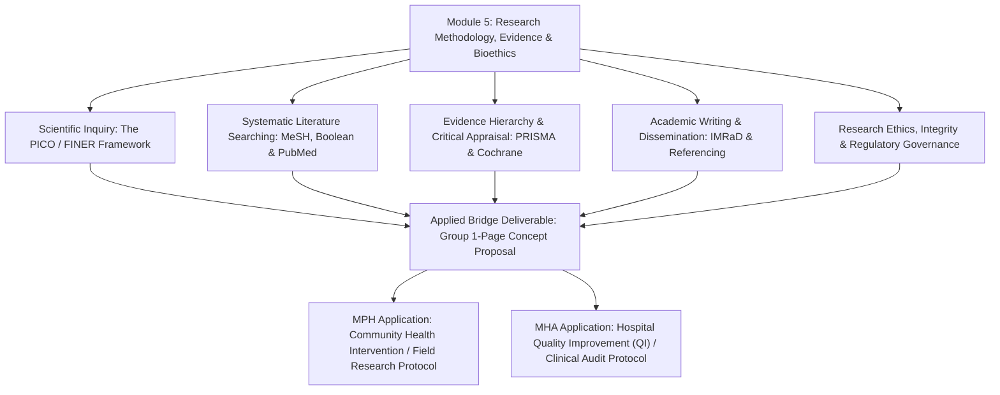

# Bridge Course: Module 5 Course Specifications & Session Plans
**Research Methodology, Evidence Synthesis, Scientific Writing & Bioethics**  
*Common Foundation for Master of Public Health (MPH) & Master in Hospital Administration (MHA)*  
*Ramaiah School of Public Health (RSPH) / Faculty of Life & Allied Health Sciences, MSRUAS*  
*Curriculum Mapping:* PHC508A & PHC510A (MPH) $\leftrightarrow$ HAC511C Unit 4 & HAC601C Unit 5 (MHA)

---

## Pedagogical Dual-Track Rationale

Both MPH and MHA curricula require mandatory **Project Work**, a two-part **Dissertation**, and evidence-based decision-making (`PHP605A`/`PHP606A`/`PHP607A` in MPH and `HAP605C`/`HAP609C` in MHA). 

However, incoming students frequently enter postgraduate study without formal training in:
1. Translating a vague health/administrative concern into a testable, structured research question.
2. Searching international biomedical databases (PubMed, Cochrane, Scopus) effectively beyond casual Google searches.
3. Distinguishing high-quality evidence from biased or predatory literature.
4. Upholding scientific integrity, avoiding unintentional plagiarism, and referencing correctly.
5. Understanding institutional ethics review (IEC/IRB), patient autonomy, and human subjects protection.

This module provides the shared methodological, scientific writing, and ethical toolkit needed before students begin coursework and dissertation planning.

---

# MODULE 5: Research Methodology, Evidence Synthesis, Scientific Writing & Bioethics

- **Target Hours:** 8 Hours (4 Hours Didactic / Methodological Seminars + 4 Hours Computer Lab & Protocol Workshops)
- **Primary Courses Mapped:**
  - MPH: `PHC508A` (Research Methodology in Public Health) & `PHC510A` (Ethics in Public Health)
  - MHA: `HAC511C` (Biostatistics and Research Methodology - Research component) & `HAC601C` (Legal Aspects and Ethics in Healthcare - Ethics component)
- **Essential Readings & Guidelines:**
  - *Jacobsen (2016). Introduction to Health Research Methods: A Practical Guide (2nd Ed.).*
  - *ICMR National Ethical Guidelines for Biomedical and Health Research Involving Human Participants (2017).*
  - *PRISMA 2020 Statement for Systematic Reviews.*
  - *Creswell & Clark (2017). Designing and Conducting Mixed Methods Research.*

### Learning Outcomes (COs)
At the end of this module, the student will be able to:
1. Formulate a structured, answerable research question using the **FINER** and **PICO** criteria.
2. Execute reproducible literature searches in biomedical databases using **Boolean operators** and **MeSH (Medical Subject Headings)**.
3. Interpret the **hierarchy of scientific evidence** (from expert opinion to systematic reviews/meta-analyses).
4. Structure a scientific document using the standard **IMRaD format** (Introduction, Methods, Results, and Discussion) and use reference management software (Zotero/Mendeley).
5. Apply the foundational principles of **bioethics** (Autonomy, Beneficence, Non-Maleficence, Justice) and identify the regulatory requirements for **Institutional Ethics Committee (IEC)** submission.
6. Recognize and prevent scientific misconduct (plagiarism, fabrication, falsification, authorship disputes).

---

### Session-by-Session Breakdown (Module 5)

#### Session 5.1: The Architecture of Scientific Inquiry (2 Hours)
- **Theory (1 Hour):**
  - What constitutes valid scientific inquiry in health? Inductive vs. Deductive logic.
  - Formulating the research problem: Moving from a broad area of interest to a focused problem statement.
  - The **FINER Criteria**: Feasible, Interesting, Novel, Ethical, Relevant.
  - Structuring quantitative clinical and public health questions using **PICO / PECO**:
    - **P:** Population / Patient group
    - **I / E:** Intervention / Exposure
    - **C:** Comparison / Control group
    - **O:** Outcome of interest
    - *(T):* Timeframe
  - Primary vs. Secondary vs. Tertiary research.
- **Workshop Activity (1 Hour):**
  - Drafting and critiquing PICO statements in mixed student pairs (e.g., comparing hospital hand-hygiene monitoring modalities vs. community water chlorination programs).

#### Session 5.2: Evidence Search Strategies & Digital Databases (2 Hours)
- **Theory & Demonstration (1 Hour):**
  - Navigating key biomedical and health sciences databases: PubMed/MEDLINE, Google Scholar, Cochrane Library, and OpenAlex.
  - Search mechanics:
    - Boolean Operators: `AND` (narrowing), `OR` (broadening synonyms), `NOT` (excluding).
    - Truncation (`*`), Wildcards, and Phrase searching (`"..."`).
    - Controlled vocabulary: **MeSH terms** vs. free-text keywords.
  - Introduction to Evidence Synthesis: Narrative reviews vs. Scoping reviews vs. Systematic Reviews (PRISMA guidelines).
- **Hands-on Computer Lab (1 Hour):**
  - Students build and execute a search string in PubMed on a chosen health topic, saving results and exporting citations.

#### Session 5.3: Scientific Writing, Structure & Reference Management (2 Hours)
- **Theory (1 Hour):**
  - The anatomy of a research protocol and dissertation: Title, Abstract, Introduction/Background, Objectives, Methodology, Ethical Considerations, Budget/Timeline (Gantt chart).
  - The **IMRaD format** for journal manuscripts.
  - Referencing conventions in medicine and health sciences:
    - **Vancouver Style** (numbered system common in biomedical journals).
    - **APA Style** (author-date system common in social/behavioral sciences).
  - Introduction to automated reference managers: Setting up **Zotero** or **Mendeley**, capturing web citations, inserting in-text citations, and generating auto-formatted bibliographies.
- **Practical Activity (1 Hour):**
  - Installing a reference manager plugin into Microsoft Word / Google Docs and formatting a 5-citation paragraph into Vancouver and APA formats.

#### Session 5.4: Bioethics, Research Integrity & Institutional Review (2 Hours)
- **Theory (1 Hour):**
  - Historical evolution of research ethics: Nuremberg Code, Declaration of Helsinki, Belmont Report.
  - Core Bioethical Principles:
    - **Autonomy (Respect for Persons):** Free and informed voluntary consent, comprehension, vulnerable populations (children, prisoners, pregnant women, mentally ill).
    - **Beneficence & Non-Maleficence:** Risk-benefit calculus, minimizing harm, ensuring physical and psychological safety.
    - **Justice:** Equitable selection of research subjects; avoiding exploitation of marginalized communities.
  - Informed Consent Process: Participant Information Sheet (PIS), Informed Consent Form (ICF), language accessibility, assent for minors.
  - Institutional Ethics Committees (IEC): Composition, roles, expedited review vs. full-board review, post-approval monitoring.
  - Research Misconduct and Publishing Ethics: Definitions of Plagiarism, Falsification, Fabrication (FFP); ICMJE authorship criteria; predatory journals.
- **Case Vignette Analysis (1 Hour):**
  - Analyzing real-world ethical dilemmas: Retrospective audit of electronic medical records without individual consent vs. public health surveillance during an outbreak.

---

## Applied Bridge Milestone Deliverable: The 1-Page Concept Protocol

At the conclusion of Module 5, mixed student teams (1 MPH student + 1 MHA student) submit and present a **1-Page Concept Protocol**:

| Protocol Section | Required Content |
| :--- | :--- |
| **Title** | Concise, descriptive title indicating population, intervention/exposure, and design |
| **Problem Statement** | 2–3 sentences defining the public health / hospital management challenge, burden, and gap in knowledge |
| **Structured Question** | Explicit **PICO** formulation |
| **Study Objectives** | 1 Primary Objective + 2 Secondary Objectives (using Bloom's taxonomy verbs: *determine, estimate, evaluate, compare*) |
| **Proposed Methodology** | Study design, study setting (e.g., Ramaiah Teaching Hospital or Bengaluru urban slum), target sample size, and sampling method |
| **Key Variables & Tools** | Dependent & independent variables, data collection instrument (survey, checklist, lab assay) |
| **Ethical Considerations** | Vulnerability assessment, consent strategy, and IEC submission plan |
| **References** | 3–5 peer-reviewed references formatted in Vancouver style using a reference manager |
